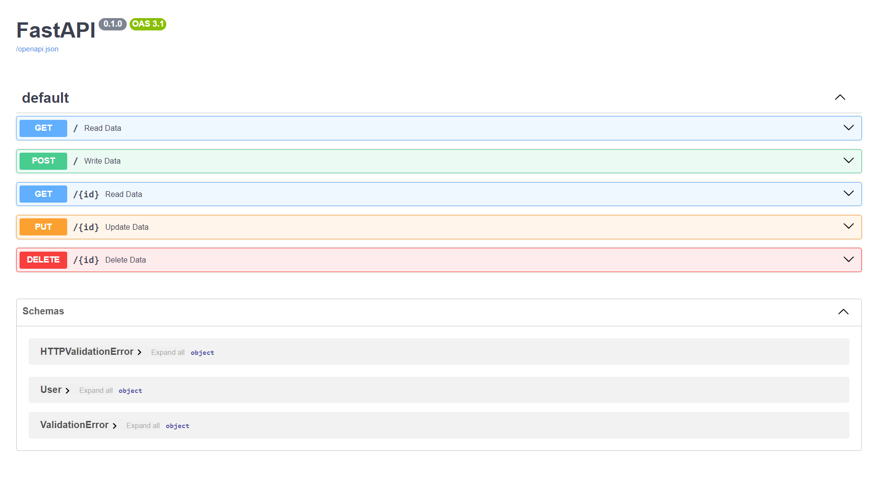

# FastAPI-MySQL-CRUD
這個專案是一個使用FastAPI和MySQL的簡單範例，專案使用到基本的CRUD（創建、讀取、更新、刪除）操作。
可以利用這個專案當作起點，以開發更複雜的Web應用程式。



## Requirement
安裝和設定
在開始之前，確保您已經安裝以下工具和資料庫：

Python 3.6+
FastAPI：pip install fastapi

Uvicorn（用於啟動FastAPI應用程式）：pip install uvicorn

MySQL數據庫(可以用 docker 來快速建置)
```
docker-compose up
```

若有自己建好的資料庫，可以改 ./config/db.py 文件來自訂資料庫的連結。

## 執行程式
使用以下指令來啟動FastAPI應用程式：
```
uvicorn main:app --reload
```
預設訪問 http://localhost:8000/docs 以來瀏覽API文檔和測試API。

### API
1. 創建新項目：POST 
定義JSON資料來建立使用者的個人檔案(name、email、password)。
2. 獲取所有項目：GET
根據 id 來檢索對應 id 的檔案。
3. 更新項目：PUT 
透過 id 和 新JSON資料來更新對應 id 的現有檔案。
4. 刪除項目：DELETE 
透過 id 來對應 id 的現有檔案。

